# Space Explorer

A real-time, seamless, scale-free explorer of the real and procedurally generated universe — a
SpaceEngine-style experience for desktop and VR headsets, built on **real astronomical data** (JPL
ephemerides, AT-HYG / HYG / Gaia DR3 stars, JPL satellite and small-body catalogues, NASA/USGS
planetary maps, the NASA Exoplanet Archive, JPL Horizons spacecraft trajectories, SIMBAD galaxies)
with deterministic procedural generation for everything the catalogues don't cover.

**What you can visit:** the Solar System with 16k close-up maps of 15 worlds · 2.75 million catalogued
stars, each with its own surface, plus billions of generated ones filling the Milky Way · **6,333
confirmed exoplanets** in 4,743 systems and a generated planetary system around (almost) every other
star · 23 black holes with lensing, accretion disks and jets · **real spacecraft** at their real
positions (ISS, Hubble, JWST, Voyager 1 & 2, New Horizons, Parker Solar Probe, Europa Clipper, Juice,
Lucy, Psyche) · **47 nearby galaxies** (Andromeda, Triangulum, the Magellanic Clouds, the Whirlpool,
the Sombrero, Centaurus A, M87 …) · **41 nebulae and star clusters** (the Orion, Carina, Eagle,
Ring, Helix and Crab nebulae, the Pleiades, Omega Centauri, 47 Tucanae …) · the Milky Way from outside ·
**real 3D ground to land on**: NASA elevation models for the Moon, Mars and Mercury, with a tour of
landmarks to fly to (Olympus Mons, Valles Marineris, the Curiosity and Perseverance sites, the Apollo 11
site, Tycho, Copernicus, Shackleton at the lunar south pole, the Caloris Basin), generated hills, craters
and shadows on other moons, and on rocky planets of other stars (their mountains and seas match their
colours; temperate worlds have blue skies) · **inside Saturn's
rings** among their ice (search "rings") · comets near the Sun with comas, tails and (up close) a
dark nucleus with jets · **eclipses at their
real times** (moon shadows crossing Jupiter, the Moon turning copper in Earth's shadow).

**Game mode (V):** fly your own ship — a cockpit with live navigation screens (sit inside it in VR),
a chase view, inertial flight, a warp drive with streaks and engine sound, fictional traffic and a
rotating space station orbiting the world you are near (fly up to its docking port and the docking
computer takes over), landing on solid worlds, missions and a discovery log.

### ▶ Live: **https://dippy34.github.io/nextjs-boilerplate/**

Desktop browser with WebGL 2 (keyboard + mouse; press **H** for controls) — or a **VR headset**: open
the link in the headset's browser (Meta Quest Browser, or Chrome/Edge on a PC with a Link/SteamVR
headset) and press **ENTER VR**.

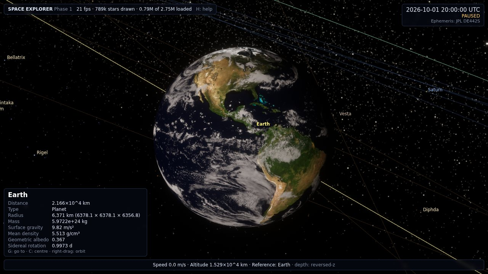

| | |
|---|---|
| 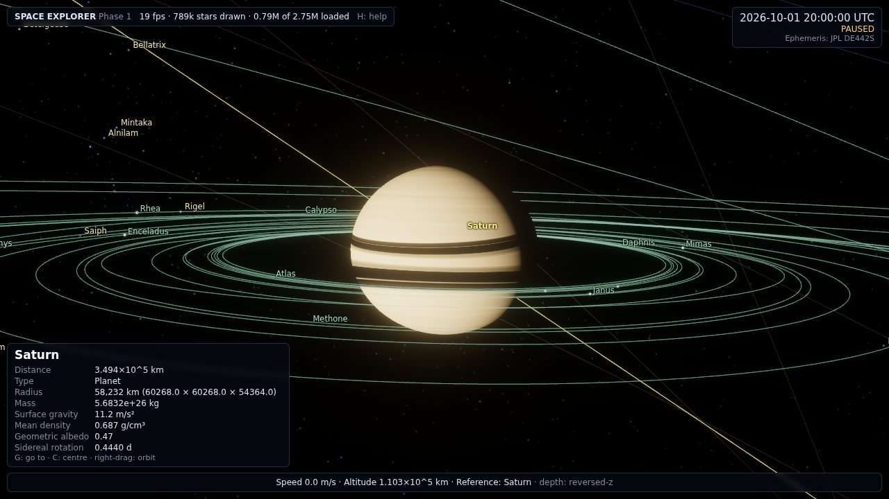 | 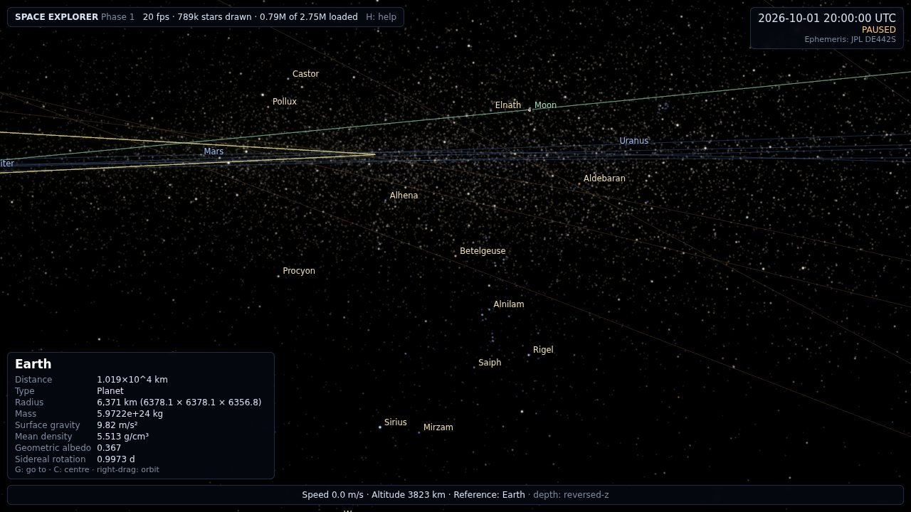 |
| 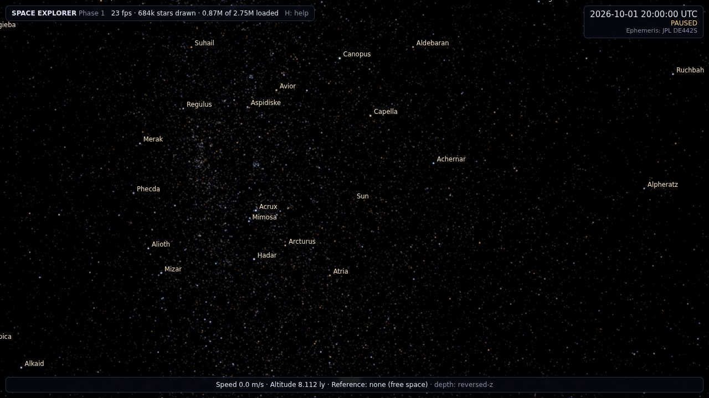 | 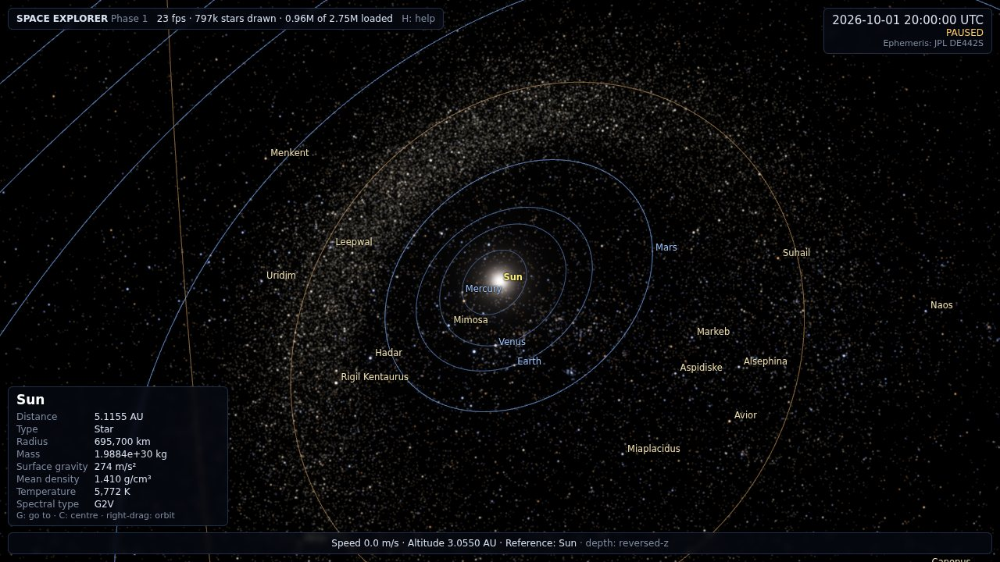 |
| 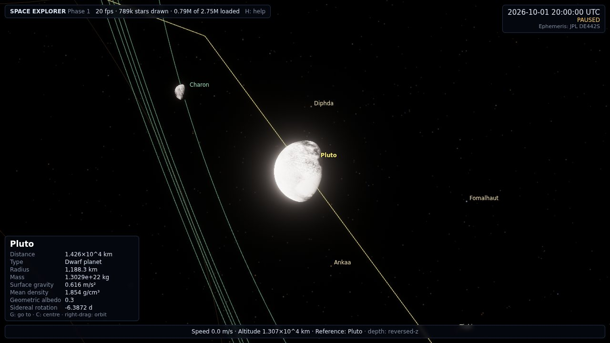 | 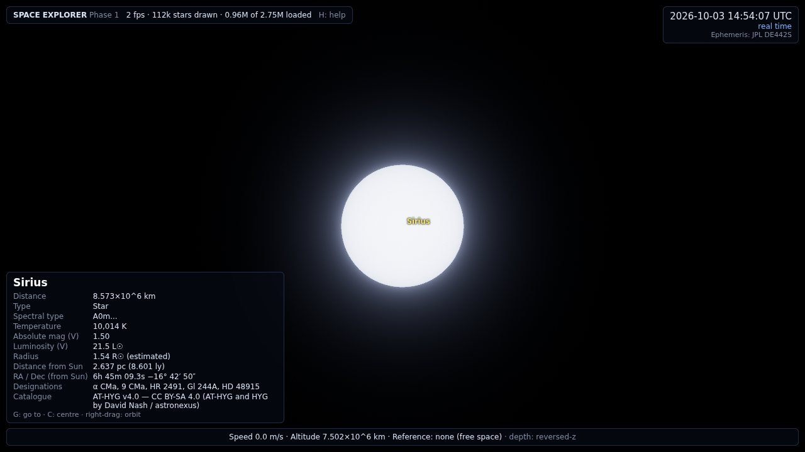 |
| 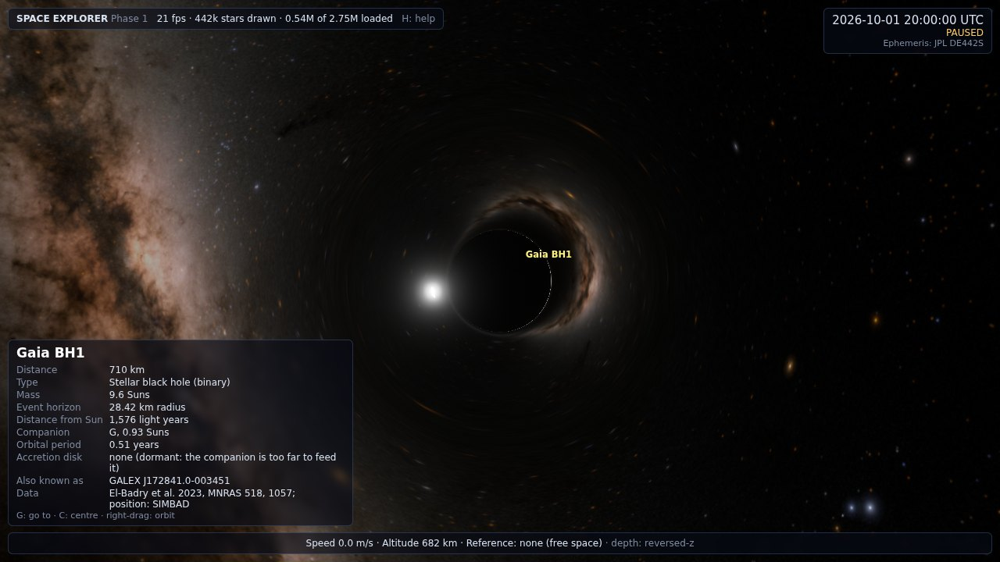 | 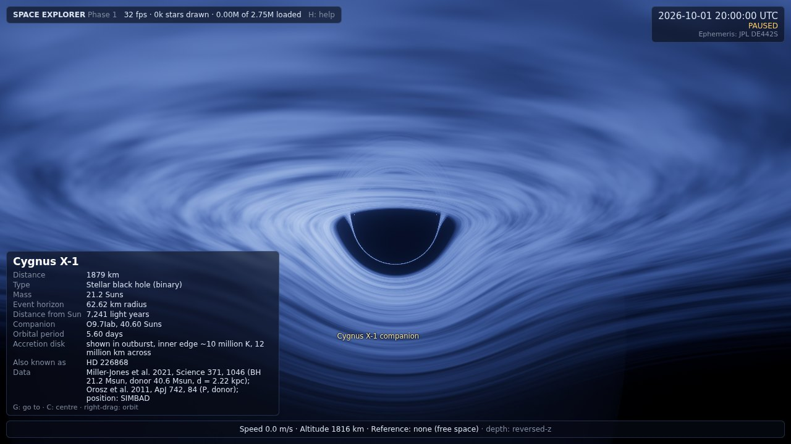 |
| 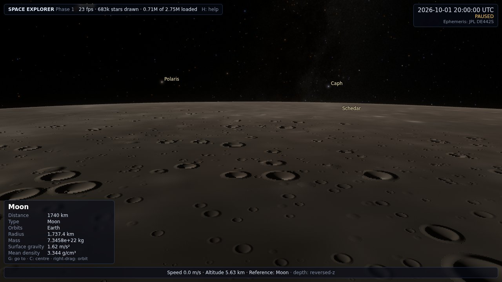 | 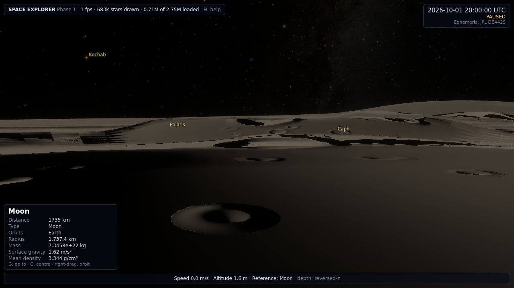 |
| 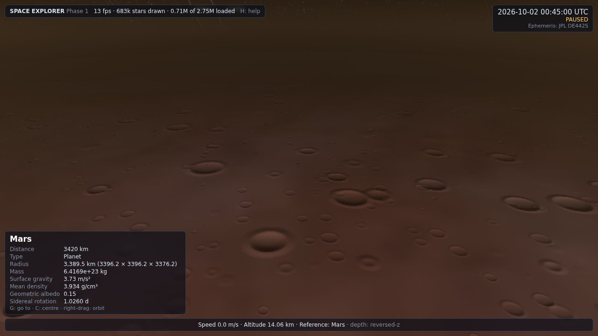 | 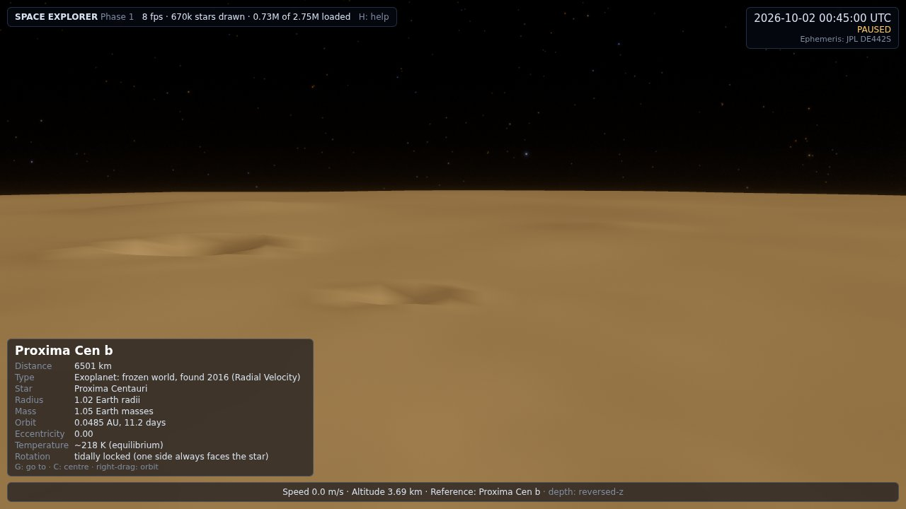 |

*Screenshots are from headless Chromium with software (SwiftShader) rendering — the automated
verification run, not hand-picked renders.*

## Quick start

```bash
npm install
npm run dev          # http://127.0.0.1:5173
```

All processed data (≈400 MB, most of it close-up map tiles) is committed under `public/data/`, so the app runs without the
pipeline. To rebuild every data file from the original sources, see [`pipeline/`](pipeline/README.md)
(`npm run data`, needs Python 3.10+ and ~0.5 GB of downloads).

Production build: `npm run build && npm run preview`.
Deploy to GitHub Pages: `bash scripts/deploy-pages.sh` (builds and force-pushes the `gh-pages` branch).

### Controls

| Input | Action |
|---|---|
| Left drag | Look around |
| Right drag / Shift + drag | Orbit around the selection |
| Wheel | Zoom towards the selection (free flight: change speed) |
| W A S D, R F | Fly; speed scales with altitude above the nearest surface |
| Shift / Ctrl | ×10 / ×0.1 speed · Q / E roll |
| Click / double-click | Select / select and go to |
| G · C | Go to selection (autopilot) · centre selection |
| Enter or `/` | Find by name (planets, 459 moons, 302 large asteroids/TNOs, 4,077 comets, 12,585 named stars, 6,333 exoplanets, spacecraft, galaxies) |
| 0–9 | Sun, Mercury … Pluto |
| Space · `[` `]` · `\` · Backspace | Pause · slower/faster time · reverse · real time now |
| L · O · M | Labels · orbits · minor-body orbits |
| P · H · Esc | Screenshot · help · stop autopilot / deselect |
| V · J · X | Spaceship (cockpit / chase / off) · warp drive to the selection · brake |
| K · N | Missions and discoveries · ship sound on/off |
| T | Tour: Saturn's rings, Olympus Mons, the Apollo 11 site, an eclipse, a comet, a black hole … |
| U | Photo mode: hide panels and labels (P saves a PNG) |

**Landing:** go to a solid world (the Moon, Mars, Mercury, Ganymede, Callisto … or a rocky planet of
another star) and keep descending (F; in VR, point the left controller down and push the left stick): below about 40 km the sphere turns
into real 3D ground, and you can fly down to standing height. In ship mode, coming down slowly below
10 m is a touchdown. For long shadows, come down near the terminator (the day/night line).

### VR (WebXR) — built for the headset

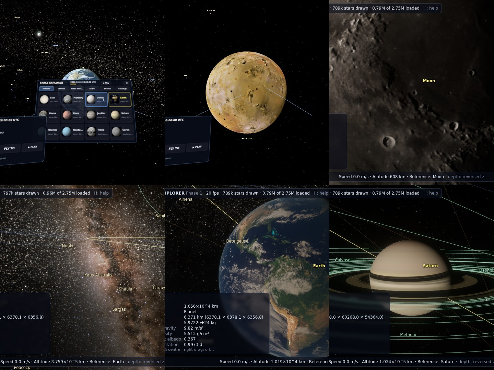

Open the link in the headset's browser (Meta Quest Browser, or Chrome/Edge on a PC with a Link /
SteamVR headset) and press **ENTER VR**. The view fades in and the **menu** opens in front of you.

* **Menu** (Y on the left controller, or MENU on your wrist): tabs for Planets, Moons (by planet),
  Small worlds (dwarf planets, big asteroids, famous comets), Stars, Exoplanets, Nebulae, Galaxies,
  Craft, **Places** (landmarks on the Moon, Mars and Mercury, and Saturn's rings), **Search** (virtual keyboard over
  every planet, moon, asteroid, comet and 12,585 named stars) and Settings. Every item shows a
  thumbnail rendered from the real map and its live distance; **point and pull the trigger** to fly there.
* **Travel** blinks, turns the view so the destination is straight ahead, then flies there in a
  straight line with a comfort vignette and parks you where the world fills your view ("Blink" travel in
  Settings jumps instead).
* **Point at anything in the sky**: a ring and its name/distance appear (with a haptic tick); the trigger
  selects it and opens an info card; pull the trigger on it again, press **A**, or "Fly to" to go there.

| Controller | Action |
|---|---|
| Trigger (either hand) | Click menus · select what the laser points at · again on the selection: fly there |
| A · B | Fly to the selection · back (stop flight / close card / close menu / deselect) |
| Y · X | Menu · pause / resume time |
| Left stick · left grip | Fly where the left controller points (speed scales with altitude) · ×10 |
| Right stick | Turn (snap 30° or smooth, in Settings) · up/down: flight speed |
| Right grip + right stick | Orbit around / zoom to the selection |
| Stick clicks | Right: labels on/off · left: real time, now |

Hand tracking (no controllers) and gaze-and-pinch work the same way: pinch = trigger. The left wrist
shows the date, time rate, selection and MENU / FLY TO / PAUSE buttons. Settings: labels, orbit lines
(off by default in VR), travel and turning style, Milky Way and star brightness, time controls, exit.

Frames go straight into the headset's stereo framebuffer (tone mapping inside every material, the
same ACES curve as the desktop), logarithmic depth, a glare sprite around the Sun instead of bloom,
and a pull-in projection for runtimes that clamp the far plane. Tested with Meta's IWER WebXR emulator
(Quest 3 profile, stereo, projection layers, controllers and hands — `npm run verify:vr`, 23 checks
including "every VR draw lands in the headset framebuffer"); not yet profiled on headset hardware.

URL parameters (also used by the automated tests): `time=2026-10-01T20:00:00Z`, `rate=86400`,
`paused=1`, `target=Saturn&dist=6&az=40&el=20` (distance in radii), `look=Betelgeuse`,
`campc=x,y,z` (camera position in parsecs), `fov=60`, `starlimit=7.5`, `gaia=0` (skip the
non-commercial Gaia dataset), `depth=log` (force logarithmic depth), `xr=0` (never offer VR),
`mw=1` (Milky Way brightness, 0 hides it).

## Why Three.js (WebGL2) + TypeScript + Vite

* **Streaming is native to the web.** The star catalogue is an octree of ~1,200 binary tiles and the
  ephemeris is chunked by decade; the browser fetches exactly what the camera needs. A desktop shell
  (Tauri/Electron) can wrap it later without changing the engine.
* **Full shader control without boilerplate.** Three.js gives render targets, HDR formats, and both
  reversed-Z (`EXT_clip_control`) and logarithmic depth, while every material here is a hand-written
  GLSL `ShaderMaterial` (stars, PSF sprites, planets, rings, GPU Kepler propagation).
* **Verifiable here.** Each phase is run and checked in headless Chromium (Playwright + SwiftShader);
  that rules out Unity/Unreal in this environment, and makes Rust/wgpu (Bevy) iteration much slower.
* Babylon.js would also work; Three.js is lighter and its WebGPU path is available later for compute.

## Architecture

```
src/
  core/      units, double-double universal positions (UPos), time scales, reference frames
  astro/     DE442S chunk evaluator, Kepler/universal propagation, IAU rotation models, photometry
  universe/  Solar System (planets, 459 moons, minor bodies), streaming star catalogue, named stars
  render/    HDR renderer (bloom + ACES), star field, Milky Way, bodies (planets, rings, Sun, relief,
             glint), atmospheres, orbits, GPU asteroids, comets (Web Worker), near stars, labels
  app/       main loop, camera rig (free fly / orbit / autopilot), input, WebXR (VR.ts)
  vr/        in-headset UI: canvas panels with hit regions, the explorer menu
  workers/   comet propagation (double precision, off the main thread)
pipeline/    Python: download → validate → convert raw catalogues into public/data/
tests/       unit tests incl. comparison against JPL Horizons reference vectors
scripts/     headless browser verification (scenario screenshots, interaction checks)
```

**Scale and precision.** Every object has a double-double position (≈32 significant digits, i.e.
millimetres at 100 Mpc). Each frame, positions are differenced against the camera in double-double,
converted to doubles and only then to float32 for the GPU — a floating origin, so the camera always
sits at (0,0,0). Depth uses a reversed-Z float32 buffer (logarithmic fallback). The camera co-moves
with whichever body's sphere of influence it is in, so time acceleration never leaves you behind.

**Photometry.** All light is in one physical unit system (radiance 1 = white Lambertian surface lit by
the Sun at 1 AU). Stars, unresolved planets, asteroids and comets are drawn as point-spread sprites
whose integrated value equals the physical irradiance at the camera, so a planet fading from disk to
dot keeps its brightness. Eye adaptation follows the brightest resolved disk in view; a perceptual
power law is applied to point sources (as SpaceEngine/Celestia do).

**Stars.** A brightest-first octree: each node holds the intrinsically brightest stars of its cube not
taken by an ancestor, so "could any star in this subtree be visible from here?" is an exact test and
tiles stream in without popping. Colours come from Planck spectra integrated against CIE colour
matching functions.

## Status

### What works (each verified before it went live)

Checked with `npm test` and the headless-browser suites (`scripts/verify.mjs`, `vr.mjs`, `game.mjs`,
`terrain.mjs`, `places.mjs`; see HANDOFF.md):

* Seamless scale from metres above a planet to kiloparsecs, floating origin, reversed-Z depth.
* 2,751,164 real stars streamed from two separately-licensed octrees (AT-HYG+HYG; Gaia DR3 100 pc
  supplement), physical brightness and blackbody colours, 12,585 named stars, picking with real
  designations (HIP/HD/TYC/Gaia DR3), stars resolve into limb-darkened disks when you fly to them.
* Solar System at the real date: JPL DE442S (1849–2150; validated against JPL Horizons to ≲50 km for
  Earth, 1 km for the Moon), JPL approximate elements outside that range, IAU rotation models (pck00011).
* 459 moons: JPL mean elements, calibrated against Horizons (median error 0.58° over 1950–2100), with
  Horizons osculating-element tables for Triton, Titan, Iapetus and the irregular moons (≤0.07°).
* 302 large asteroids/TNOs as full bodies, 75,565 numbered asteroids propagated on the GPU, 4,077
  comets propagated in a Web Worker.
* Every body and star looks like itself: stars get their own granulation, spots, flares, flattening
  and corona from their temperature and size (giant convection cells on red supergiants); the 459
  moons and the asteroids get 4K maps from the full-resolution USGS mosaics or, where no spacecraft has
  mapped them, a seeded procedural surface and an irregular shape for small bodies; each black hole has
  its own disk temperature, gas pattern and (for M87\* and the microquasars) jets.
* NASA/USGS global maps for 23 bodies, Earth night lights and clouds, Saturn's rings from the Voyager 2
  PPS occultation profile with planet↔ring shadows.
* Free flight with altitude-scaled speed (metres/s to parsecs/s), orbit mode, logarithmic go-to
  autopilot, time control (pause, ×1 … 100 years/s, reverse), labels, orbit lines, search, info panel,
  screenshots.
* Immersive VR (WebXR) designed for the headset: in-headset menu with planet/moon/star browser and
  virtual-keyboard search, laser pointing with hover and haptics, comfortable travel, info cards,
  wrist panel, 3D labels, controllers and hand tracking.
* Visuals: the real Milky Way (NASA SVS Deep Star Maps, Gaia DR2) behind the catalogue stars;
  single-scattering atmospheres (Earth, Mars, Venus, Titan, giant-planet limb haze) with reddened
  sunlight at the terminator; relief from real elevation models (LOLA, MOLA, MESSENGER, ETOPO 2022);
  sun glint on Earth's oceans; 8k maps of Earth, Moon, Mars and Mercury streamed on demand; Saturn,
  Uranus and Neptune from 2025 Hubble OPAL maps; giant-planet and Titan colours from measured albedo
  spectra.
* Black holes: 23 real ones (every dynamically confirmed stellar black hole in BlackCAT, Cygnus X-1,
  Gaia BH1–3, Sagittarius A\*, M87\*) with their companion stars on their real orbits. Light is traced
  past each hole in the Schwarzschild metric per pixel, so the sky behind it bends into Einstein rings,
  the far side of the accretion disk arcs over the shadow, and Doppler beaming brightens the side
  coming towards you. Search for them, or open the **Deep space** tab in the VR menu.
* The whole Milky Way: a parametric model of the galaxy (thin and thick disks, the boxy bar, four
  spiral arms and the local spur, dust, the nuclear star cluster around Sgr A\*) drives both the
  galaxy's unresolved glow — ray-marched through the dust into a cube map, cross-fading from the
  real NASA map as you leave the Sun's neighbourhood — and **tens of billions of procedural stars**
  generated on demand in Web Workers wherever the catalogues end. Every generated star is
  deterministic (it is always the same star, with a designation like `PS 9.41.-3.0-17` you can
  search for) and none duplicates a catalogued one. Fly to the galactic centre and Sgr A\* sits
  in a blazing star cluster; search "Milky Way" to leave the galaxy and see the barred spiral from
  outside.
* Beyond the Solar System: 6,333 confirmed exoplanets placed around their catalogued stars, a generated
  system around almost every other star, 47 nearby galaxies, 41 nebulae and clusters, and real
  spacecraft on their trajectories.
* Landing: real 3D ground from NASA elevation models (sharper patches around landmarks), generated
  hills, craters and shadows elsewhere, walking at eye height, rocky planets of other stars with
  matching terrain and Earth-like skies.
* Saturn's rings from the inside, comets with comas, tails and nuclei, eclipses and moon shadows at
  their real times.
* Game mode: cockpit and chase views, inertial flight, warp, traffic, docking at stations, landing,
  missions and a discovery log.

Known limitations (planned for later phases unless noted):

* Close to a solid world the ground becomes real 3D terrain: elevation models for the Moon, Mars and
  Mercury (about 5–10 km per sample) with generated relief below that, generated relief on other
  round moons, dwarf planets and rocky planets of other stars. Earth, Venus, Titan and small
  irregular bodies keep smooth surfaces with relief shading.
* Venus uses procedural banding tinted with the Mariner 10 disk colour; the Viking Mars mosaic is
  somewhat over-saturated; OPAL maps miss the latitudes Hubble could not see (filled zonally).
* The Milky Way model is smooth and idealised (arm positions, a clumpy noise for dust and star
  clouds). Other galaxies are procedural discs/spheroids with their catalogued size, type and
  orientation (no individual stars inside them); nebulae are procedural at their catalogued size
  (billboards from afar, a ray-marched volume up close; their shapes are not the real ones);
  globular-cluster stars are generated.
* Terrain shadows are ray-marched per mesh vertex, with the edge placed per pixel (features
  smaller than the mesh spacing cast none). The global elevation models are coarse (5–10 km per
  sample; 0.24–0.9 km in the patches around the landmarks) with generated relief below that, which
  is plausible, not mapped. Generated planets' atmospheres are Earth-like for every temperate world.
* Generated planets are labelled as such; their counts and sizes follow occurrence statistics, not
  observations. Orbit orientations and phases of most real exoplanets are unmeasured and chosen
  deterministically.
* Game-mode ships are fictional. The ISS and Hubble are propagated from one set of orbital elements
  (2026-10-01), so they drift from their real positions over weeks. Procedural stars beyond the catalogues
  are plausible, not real: their densities, colours and luminosities follow the model.
* Star radii are estimated from V magnitude and temperature (no bolometric correction). Gaia DR3
  places Sirius B 0.033 pc from Sirius A (a known astrometry problem for that binary).
* Moons without published sizes get a deterministic procedural radius, flagged "estimated".
* Comet comas and tails are a model: their size follows each comet's catalogued total-magnitude
  parameters (M1, K1) and distance from the Sun, the ion tail points straight away from the Sun and
  the dust tail curves back along the orbit; real tails vary with outbursts. The asteroid-belt
  brightness boost for distant asteroids is artistic (physical within 0.05 AU).
* Pluto has no ephemeris outside 1849–2150. Eclipses and moon shadows treat bodies as spheres (up to
  four shadowing bodies at a time), and the coppery light in Earth's shadow is a simple tint.
* VR has no bloom pass (a glare sprite around the Sun stands in) and starts at a lower star magnitude
  limit (6.8, adjustable in Settings) to protect frame rate.
* Atmospheres are single scattering (no multiple scattering) and ignore terrain height. The Milky
  Way map is Earth-centred and fades out beyond ~1 kpc.
* Black holes are non-spinning (Schwarzschild).
* Performance has been verified only under software rendering (≈20–30 fps at 720p; ~3–5 ms JS per
  frame). GPU profiling and quality presets come in Phase 6.

### Roadmap

2. Planet rendering: cube-sphere quadtree terrain from real DEMs, Bruneton atmospheric scattering,
   oceans, clouds, space-to-surface descent and surface walking.
3. Nebulae and star clusters (OpenNGC), a finer Milky Way seen from outside.
4. Sharper terrain everywhere (streamed elevation tiles), Earth terrain; more stations and ship types.
5. Full UI: search panel, bookmarks, settings and quality presets.
6. Polish: lens flares, spinning (Kerr) black holes, performance tuning.

## Data and credits

See [CREDITS.md](CREDITS.md). Licences differ per dataset — notably the Gaia DR3 supplement
(`public/data/stars-gaia/`) is **CC BY-NC 3.0 IGO (non-commercial)** and the AT-HYG/HYG-derived star
tiles are **CC BY-SA 4.0**. Source code is MIT.
